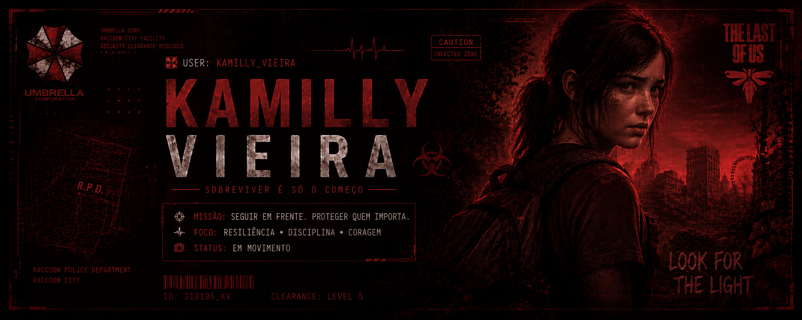

 

  

  

  

###

<h1 data-importer="text" align="center">˚ 🩸 ✦  Seja bem-vindo! ✦🩸 ˚</h1>

###

<h3 data-importer="text" align="center">- Gamer por paixão & Dev Front-End em construção</h3>

###

  

###

<h1 data-importer="text" align="left">⊹₊˚‧ Sobre Mim ‧˚₊⊹</h1>

###

<h4 data-importer="text" align="left">Olá! Me chamo Kamilly Vieira (mas todos me chamam por Milly ). Sou uma entusiasta do desenvolvimento web apaixonada por criar interfaces bonitas, intuitivas e que contem uma história. 🕸️˚✦   🔴 Nosso Objetivo ✦ ::  Evoluir um código de cada vez e criar experiências digitais incríveis.</h4>

###

<h3 data-importer="text" align="center">────────────────────────────────────</h3>

###

<h1 data-importer="text" align="left">Tecnologias & Ferramentas</h1>

  
  
  
  
  
  
  
  
  

  

<h3 data-importer="text" align="center">────────────────────────────────────</h3>

 

<h1 data-importer="text" align="left">Meus Interesses</h1>

<h4 data-importer="text" align="left">💻 Desenvolvimento Front-end ✦ (Aprofundando conhecimentos diariamente)  🎨 Design de UI/UX ✦ Prototipagem específica no Figma  🎬 Animações e Interatividade Avançada: Criação de interfaces ricas, efeitos visuais e transições fluidas usando JS puro (Vanilla).</h4>

<h3 data-importer="text" align="center">────────────────────────────────────</h3>

###

###

<h1 data-importer="text" align="left">Atuais Projetos e Missões</h1>

###

👥 Desenvolvendo o projeto SOS PET junto com minha equipe.  🧟 Criando de forma independente o Cantinho da Milly (um espaço totalmente com a minha identidade).  💼 Em breve: Construção do meu portfólio oficial.

###

###

 

<h4 data-importer="text" align="center"> 🔥 ˚✦ "Look for the Light..." 🩸 ˚✦</h4>

###

###

<h1 data-importer="text" align="center">︵‿₊ Vamos nos conectar ₊‿︵‧</h1>

###

 

&nbsp;
&nbsp;

---

###

˚✦  Criado com amor por KodeKam  🧟🕸️

###

